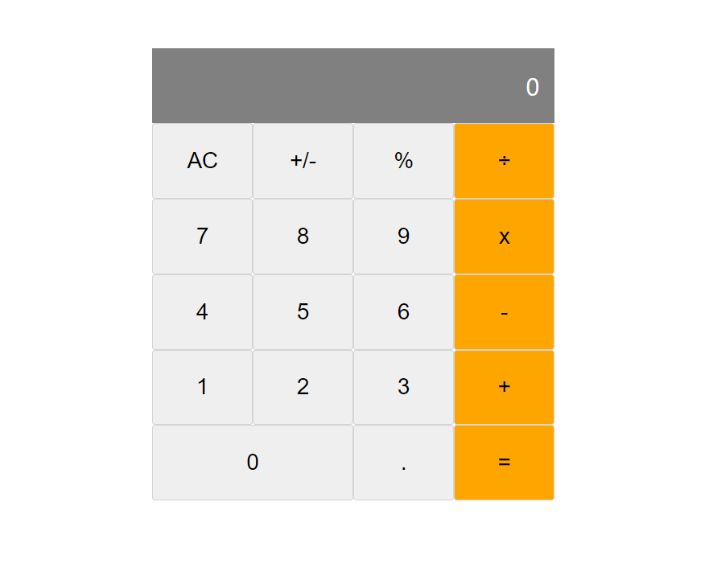

# Math Magicians Website

> Math Magcians is a website with an online caculator that enables one to perform mathematical calculations.

## Website Link

[Click to see Website](https://626aa42a3e47df12ae36edb3--roaring-manatee-9a960c.netlify.app/)

## Screenshot

## Built With

- Major languages: Javascript, HTML & CSS
- Frameworks: React
- Technologies used: Webpack, big-js, babel

## Authors
👤 **Nwachan Theophile**

- GitHub: [@Theophileash](https://github.com/Theophileaseh)
- Twitter: [@NwachanT](https://twitter.com/NwachanT)
- LinkedIn: [LinkedIn](https://linkedin.com/in/nwachan-theophile-342274172)

## 🤝 Contributing

Contributions, issues, and feature requests are welcome!

Feel free to check the [issues page](../../issues/).

## Show your support

Give a ⭐️ if you like this project!

## Acknowledgments

- Hat tip to anyone whose code was used
- Inspiration
- etc

## 📝 License

This project is [MIT](./MIT.md) licensed.
